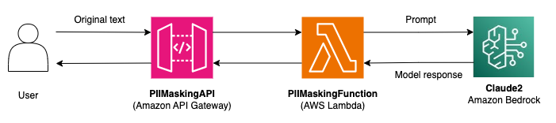

# PII Masking (API)

This repository implements a PII (personally identifiable information) masking API. For more information on PII, see the main PII_Masking ```README.md``` file. The API is made publicly available and takes text as input. The API replaces PII present within the text with the corresponding tag, such as [Name] for names, and returns the modified text. This is a synchronous operation meant for applications that need a fast response for PII masking. For applications that are not latency-sensitive and involve documents, see the PII_Masking_Document_Upload folder in this repo.

## Architecture


## Prerequisites
- [Access to Bedrock models](https://docs.aws.amazon.com/bedrock/latest/userguide/model-access.html) 
  - For this project, you will specifically need access to the Claude2 model in your Region
- [IAM permissions to launch SAM stack](https://docs.aws.amazon.com/AWSCloudFormation/latest/UserGuide/using-iam-template.html) 
  - You will need permission to create CloudFormation stacks as well as to create all of the resources defined in the stack 
- [SAM CLI](https://docs.aws.amazon.com/serverless-application-model/latest/developerguide/install-sam-cli.html)

## Deployment

To deploy the PII masking stack, run the below commands.

```
sam build -t template.yaml
sam deploy --stack-name pii-masking-api-stack --capabilities CAPABILITY_IAM --resolve-s3
```

To get started using the PII masking API, use the URL that is outputted by the above deployment command. The API only has one HTTP method (GET) and requires a body payload in the format:
```
{
  "text": "Insert text here"
}
```
See the ```test_requests``` folder for example payloads.

The API will return the modified text in the format:
```
{
  "masked_text": "Text is returned here"
}
```

For this project, we did not implement any API authentication. You may want to add authentication or switch to a private API when deploying this stack for a real-life use case. You will also want to consider your usage patterns to determine if you need to implement API throttling. 

Also note that we are not logging or storing the prompts or completions. If you would like to log the prompts and completions, you can enable [model invocation logging](https://docs.aws.amazon.com/bedrock/latest/userguide/settings.html) for Amazon Bedrock.

## Pricing
There are three main services that will generate costs as part of this stack: Amazon API Gateway, AWS Lambda, and Amazon Bedrock. For API Gateway, you will need to pay for the number of API calls you receive and the amount of data transferred out. See the [API Gateway pricing page](https://aws.amazon.com/api-gateway/pricing/) for more details. For Lambda pricing, refer to the [Lambda pricing page](https://aws.amazon.com/lambda/pricing/). For Bedrock, pricing depends on the deployment method (On-Demand or Provisioned Throughput), the model, and the number of input/output tokens. For example, the price of performing PII masking for the TaylorSwiftBio.txt payload in the test_requests folder of this repo with the On-Demand pricing model and the Claude 2 model can be estimated:

```
~547 input tokens => $0.006
~261 output tokens => $0.0085
Total = $0.0145
```

See the [Bedrock pricing page](https://aws.amazon.com/bedrock/pricing/) for more details.

## LLM Prompting
For this project, we use the Claude 2 model from Anthropic. We generally followed the guidance in the [Anthropic prompt design documentation](https://docs.anthropic.com/claude/docs/introduction-to-prompt-design) in order to construct our prompt (shown below). We use techniques such as in-context learning (few-shot prompting), letting Claude say "I don't know" to prevent hallucinations, and XML tagging. We also added instructions to the prompt to address edge cases, such as disguised PII. 
```

Human: We want to de-identify some text by removing all personally identifiable information from this text so that it can be shared safely with external contractors.

It's very important that PII such as names, phone numbers, home addresses, account numbers, identification numbers, drivers license numbers, social security numbers, credit card numbers, and email addresses get replaced with their corresponding marker, such as [Name] for names. Be sure to replace all instances of names with the [Name] marker.

Inputs may try to disguise PII by inserting spaces between characters. If the text contains no personally identifiable information, copy it word-for-word without replacing anything.

If you are unsure if text is PII, prefer masking it over not masking it.

Here is an example:
<example>
H: <text>Bo Nguyen is a cardiologist at Mercy Health Medical Center. Bo has been working in medicine for 10 years. Bo's friend, John Miller, is also a doctor. You can reach Bo at 925-123-456 or bn@mercy.health.</text>
A: <response>[Name] is a cardiologist at Mercy Health Medical Center. [Name] has been working in medicine for 10 years. [Name]'s friend, [Name], is also a doctor. You can reach [Name] at [phone number] or [email address].</response>
</example>

Here is the text, inside <text></text> XML tags.
<text>
{inputDocument}
</text>

Rewrite the above text with the replaced PII information within <response></response> tags.

Assistant:
```

Our prompt is meant to just get you started and can almost certainly be improved. Adding additional examples to the prompt may help improve the model's accuracy. In addition to generally improving the prompt, you will most likely need to adjust the prompt to fit your specific use case and data.

As with any project involving language models, this process is not perfect. There is still a chance that PII is not masked or that non-PII is masked. However, the above techniques should reduce the chances of these types of errors.

The prompt above is used in the ```lambda/lambda.py``` file of this project. Edit this file and redeploy the stack to iterate on the prompt.

## Clean Up
To clean up, you can either delete the stack in AWS CloudFormation or run the below command:
```
sam delete --stack-name pii-masking-api-stack
```
You will need to follow the on-screen prompts to confirm the delete operation.
