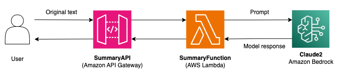

# Summarization (API)

This repository implements a summarization API. The API is made publicly available and takes text as input. The API returns a <300 word summary of the input text. This is a synchronous operation meant for applications that need a fast response for summarization. Note that at the time of writing this, the timeout for APIs built with Amazon API Gateway is 30 seconds, so you may receive a timeout exception if the service is not able to respond in < 30 seconds (can occur with long inputs). For applications that are not latency-sensitive, involve documents, or will require >30 second processing time, see the Summarization_Document_Upload folder in this repo.

## Architecture


In order to handle large amounts of input text, we check whether or not the input text can fit into the model's context window. If the input text will not fit, we use the LangChain ```map_reduce``` chain type to create summaries of individual chunks of text, followed by a final summary. The image below was taken from the [LangChain summarization documentation](https://python.langchain.com/docs/use_cases/summarization) and provides a good visual of how we handle inputs of different sizes.


## Prerequisites
- [Access to Bedrock models](https://docs.aws.amazon.com/bedrock/latest/userguide/model-access.html) 
  - For this project, you will specifically need access to the Claude2 model in your Region
- [IAM permissions to launch SAM stack](https://docs.aws.amazon.com/AWSCloudFormation/latest/UserGuide/using-iam-template.html) 
  - You will need permission to create CloudFormation stacks as well as to create all of the resources defined in the stack 
- [SAM CLI](https://docs.aws.amazon.com/serverless-application-model/latest/developerguide/install-sam-cli.html)

## Deployment

To deploy the summarization stack, run the below commands.

```
sam build -t template.yaml
sam deploy --stack-name summarization-api-stack --capabilities CAPABILITY_IAM --resolve-s3
```

To get started using the summarization API, use the URL that is outputted by the above deployment command. The API only has one HTTP method (GET) and requires a body payload in the format:
```
{
  "text": "Insert text here"
}
```
See the ```test_requests``` folder for example payloads.

The API will return the modified text in the format:
```
{
  "summary": "Text is returned here"
}
```

For this project, we did not implement any API authentication. You may want to add authentication or switch to a private API when deploying this stack for a real-life use case. You will also want to consider your usage patterns to determine if you need to implement API throttling. 

Also note that we are not logging or storing the prompts or completions. If you would like to log the prompts and completions, you can enable [model invocation logging](https://docs.aws.amazon.com/bedrock/latest/userguide/settings.html) for Amazon Bedrock.

## Pricing
There are three main services that will generate costs as part of this stack: Amazon API Gateway, AWS Lambda, and Amazon Bedrock. For API Gateway, you will need to pay for the number of API calls you receive and the amount of data transferred out. See the [API Gateway pricing page](https://aws.amazon.com/api-gateway/pricing/) for more details. For Lambda pricing, refer to the [Lambda pricing page](https://aws.amazon.com/lambda/pricing/). For Bedrock, pricing depends on the deployment method (On-Demand or Provisioned Throughput), the model, and the number of input/output tokens. For example, the price of performing summarization on the moon_landing.txt payload in the test_requests folder of this repo with the On-Demand pricing model and the Claude 2 model can be estimated:

```
~16500 input tokens => $0.182
~250 output tokens => $0.008
Total = $0.19
```

See the [Bedrock pricing page](https://aws.amazon.com/bedrock/pricing/) for more details.

*Note that a large payload such as the one defined in moon_landing.txt may result in a timeout error. Consider using the Summarization_Document_Upload architecture for large payloads. 

## LLM Prompting
For this project, we use the Claude 2 model from Anthropic. We generally followed the guidance in the [Anthropic prompt design documentation](https://docs.anthropic.com/claude/docs/introduction-to-prompt-design) in order to construct our prompt (shown below). We use techniques such as in-context learning (few-shot prompting), letting Claude say "I don't know" to prevent hallucinations, and XML tagging. For few-shot prompting, we included an example summary of a post-game interview transcript with Notre Dame quarterback Sam Harman from October 14th, 2023.
```

Human: Given a set of summaries, we want to distill them into a final, consolidated summary of the main themes.

Write your summary within <summary></summary> tags.

Here is an example:
<example>
H: <text>
Q. Sam, you have been through games like Louisville last week, but was it any different here to come back from the adversity with USC coming in, and just how did you sort of manage that over the last seven days?
SAM HARTMAN: Yeah, they're wild out there. It's awesome. I think it's like what Coach Freeman just said, we are a reflection of our head coach. It's been a bumpy season. You know, you start hot and you lose a close one to Ohio State, and so it's one of those things where, like you said, being in those situations before prepares you for the ridicule, the feeling, the pit in your stomach.
But like coach said, it was a really special week. I saw this thing, John Jones, I don't condone everything he does, but saw a thing where he talks about pre-fight. Talks about the butterflies are in formation when you get butterflies or a pit in your stomach. Not to say that that's some crazy cool message that's going to end up on some cool highlight, but it's what I felt the team felt.
I felt like all week we as a unit, and again, obviously on defense, one of the best defensive performances I've ever seen against one of the nest offenses in the country. Really just the mentality, the work, preparation, all kind of just aligned perfectly.
It's a credit to our head coach. You know, without his leadership and guidance through a new landscape where losses aren't acceptable, and not to say that other losses are, but it was something that just from day one, from Monday night when we were in there and guys are beat up and we're all kind of like, shoot, man, we got to go.
It was something we said all week, too, is what better opportunity than to come have USC come play at home. We got really good weather and I think we did exactly what we wanted to do all week, and it's a moment that I'll never forget. I hope there our fans out there that will never forget, and forever I can say when I came here and played USC we won and I'm 1-0.
Q. The TD to Tyree, just take me through the look, how that play developed.
SAM HARTMAN: Yeah, all week we kind of had a bead on some of their coverages of what they might run to certain formations, and got one there. It's a credit to him. I'm so glad you asked about CT. You don't see that anywhere really ever. You know, older guy like that. His persistence, who he is as a man will take him so much further than anyone can ever know, and that's something that I'll always be forever grateful for him.
To be an older guy and have some struggles and have to change positions, like that itself, you know, and he's had some bad stuff and some drops and some things you're like, oh, man you got to make that play. He just kept showing up.
You bring Faison in, an incredible player, and you're like, most guys, probably, you know, I'm going to take a step. Chris kept showing up. Chris helped Faison and Faison helped him get open on that play. It's a credit to the coaching after, the culture here, and just to Chris as a man. You don't find that everywhere, and I was so happy.
The first thing we said is, I told you to each other, because all week we been talking about it. It's going to come, it's going to happen, you're going to get that opportunity, and he was freaking wide open, so made it pretty easy for me.
Q. How critical was the touchdown to open the game after you guys get the turnover? Third down conversion, but also a touchdown to give you guys some confidence moving forward.
SAM HARTMAN: It's everything. We wanted to start fast. That's kind of our big three of this week. We really look back at the games that we played well in, and it was like a first-drive touchdown was huge. We kind of knew their offense was going to be able to score. Honestly our defense really shut them down and gave them a lot of frustrations.
It was big in the beginning of the game, but our defense kept us just on a groove and really good field position.
So like they say, defense wins championships. I guess I got to buy Al Golden another Ferrari. They ain't paying me enough to do that.
Q. What conversations did you have with the offensive line after a bit of a rough go last week, to come back out tonight and have a different performance?
SAM HARTMAN: I think it's all culture. I don't think anything I was going to say was going to change the way they showed up. I don't think it's anything to do with mindset, skill, anything.
Just Louisville is really good team, and they lost, so takes away that bluster. Did they?
Q. Yeah.
SAM HARTMAN: Okay, it starts with Zeke and the guys on the outside. They really set the tone, and Zeke was the first one in the building and he was the first one getting everyone motivated, and just kept saying all week, take your mind there. That was probably the best thing anyone could say. You're in the dog days of it, it's Tuesday, eight-week bender and we're rolling.
To get guys fricking going like we did this Saturday was incredible. They set tone for the rest of the season that you got to play Notre Dame.
Q. You kind of touched on this before, but you have been through wins and losses in your career. What's it like to go through a loss and then a win, the low and the high, like at this school?
SAM HARTMAN: I mean, it's incredible. We don't like saying I around here and you guys rarely hear it, but it's special for me. I hugged Coach Freeman after and I was like, I finally did it. Really our defense did it. I mean, I threw the ball is couple times.
But it's, again, kind of like I led off with, it'll be a special moment for me and I'm excited to get back in the locker room. Just to see the fans and the support we get continuously and the walk and just the football culture here, I hope it never changes. If I'm blessed to have kids I hope I can bring them back and they play a highlight. Probably won't be as cool as Joe Montana, but -- you know, I met Joe Montana today. That was pretty sweet. Probably add that, USC victory, Joe Montana.
And I think that that is going to be something I can kind of cherish for the rest of my life. And the memories with those guys in the locker room, to bring it back to the team, just Cam Hart, you see that guy and his disappointment and his frustrations of last week, and to see him bounce back and just see the entire team, just it was a full, complete game. I'm so grateful for that. Grateful for this fan base and everything.
I freaking love the Irish.
Q. Some joking aside, USC is above meeting Joe Montana. You've been in college football for a while now. What did you pick up this week, tonight, about this particular game, matchup up at Notre Dame?
SAM HARTMAN: I mean, all week it was just something for me that was new. I know going we had an Irish immersion program in California. I got to meet some people. Got to meet Jimmy Clausen. Everybody talked about it out there, right, beat USC, beat USC. It was, beat Ohio State before that.
It was everybody you meet walking to the airport, grabbing groceries at Trader Joe's, beat USC. We brought back the trophy and regained that, and it's been a tradition to win at home and that's something I'm really proud of and proud of this team for rallying around it.
I know the magnitude. I'll be training in California for the pro stuff and I'll have that little kind of -- I can walk a little bit higher and taller out there.
</text>
A: <summary>
Quarterback Sam Hartman discussed Notre Dame's comeback win against USC. He said the adversity after losing to Louisville challenged the team, but coach Marcus Freeman's leadership guided them through. Hartman said the team had a \"special week\" preparing for USC, one of the best offenses in the country. He credited the historic defensive performance that shut down USC. Offensively, Hartman discussed the importance of scoring a touchdown on the first drive to build confidence. He praised receiver Chris Tyree for his persistence and growth this season despite struggles. Their connection on a touchdown pass exemplified Tyree's hard work. Hartman also credited the offensive line for bouncing back after a rough game against Louisville. He said the culture and leadership of players like center Zeke Correll set the tone in practice to be ready for USC. Personally, Hartman called the USC win a special moment in his career that he'll cherish. He said the fan support and football culture at Notre Dame are incredible. Beating a storied rival like USC will stay with him forever.
</summary>
</example>

Here is the text, inside <text></text> XML tags.

<text>
{text}
</text>

Write a <300 word concise summary of the above text within <summary></summary> tags.

Assistant:
```

Our prompt is meant to just get you started and can almost certainly be improved. Adding additional/better examples to the prompt may help improve the model's accuracy. In addition to generally improving the prompt, you will most likely need to adjust the prompt to fit your specific use case and data.

As with any project involving language models, this process is not perfect. There is still a chance that the summary is not entirely accurate. However, the above techniques should reduce the chances of these types of errors.

The prompt above is used in the ```lambda/lambda.py``` file of this project. Edit this file and redeploy the stack to iterate on the prompt.

## Clean Up
To clean up, you can either delete the stack in AWS CloudFormation or run the below command:
```
sam delete --stack-name summarization-api-stack
```
You will need to follow the on-screen prompts to confirm the delete operation.
